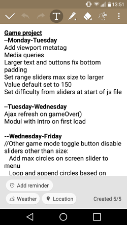
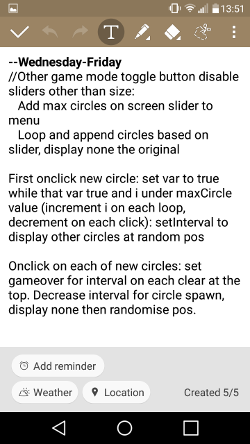

# Circle Game
Click on the circle as soon as it appears miss then **gameover** don't click in time then **gameover**
More successful clicks means a smaller target, a shorter time to click but also an increased score

~~Friday~~: ~~swap over to div and add fadeOut~~<br>
~~Saturday~~: ~~add menu~~<br>
~~Sunday~~: ~~add theme (BONUS: fixed mobile)~~<br>
~~Monday-Tuesday:~~ ~~Fix mobile~~, ~~Ajax refresh on gameOver, add instructions~~<br>
Tuesday-Thursday: Add new game mode, get presentation ready

## Issues:
- [x] No score for Juggle mode
- [x] To small on mobile
- [x] Circle goes off screen
- [x] Misclick not working

## Todo:
- [x] Show misses when miss gameover not on
- [x] Clean up code
- [x] Add more themes, duckhunt, pokemon
- [x] fix gameOver, add modal on game over to show score and clicks then reset game (ajax?)
- [x] Give instructions through modal then Ajax to refresh frame on gameover
- [x] setInterval dot change (setInterval bottom of move func, clearInterval at top) if function with interval runs gameOver
- [x] After x amount of clicks shrink circle, set interval time smaller, change score multiplyer
- [x] fadeOut in sync with timeout
- [x] **MENU** <br>
    - [x] Toggle gameOver on: timeout, miss
    - [x] Toggle fadeout
    - [x] Sliders for initial interval time and width & height
    - [x] Difficulty buttons set sliders and submit at pre defined points
    - [x] ~~Modul with info on effect of menu items??~~ do this in instructions
- [x] Toggle button for ~~"mania"~~ "Juggle" keep as many bricks on the screen as possible
### Todo extra:
- [x] Pre defined themes on drop down in menu
    - [x] Check this for color blind
- [x] New game mode multiple circles
- [ ] Static/linear toggle button?????

### Notes:

<br>
Modal instructions & settings <br>
Main color hex: #c20000 <br>
Font: ```<link href="https://fonts.googleapis.com/css?family=PT+Sans" rel="stylesheet">``` <br>
https://fonts.google.com/?selection.family=PT+Sans
