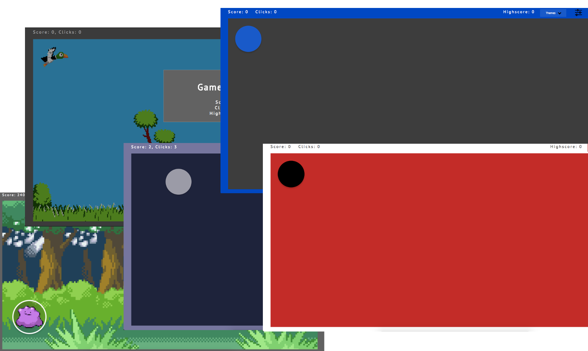
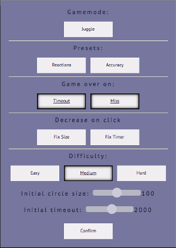

# <span style="color:#c20000; letter-spacing: 5px;font-family: 'PT Sans', sans-serif;">Circle Game</span>
<span style="color:#c20000;font-family: 'PT Sans', sans-serif;">Summary</span>
---
Click on the circle as soon as it appears miss then **gameover** don't click in time then **gameover**
More successful clicks means a smaller target, a shorter time to click but also an increased score<br>


<span style="color:#c20000;font-family: 'PT Sans', sans-serif;">How to play:</span>
---
To play the game online visit: https://slewis96.github.io/Circlegame/

To play the game locally download all the files and simply open index.html in your desired browser

<span style="color:#c20000;font-family: 'PT Sans', sans-serif;">Recommendations</span>
---
Desktop users:  

* I recommend using a mouse for a better experience (If you are really good with a trackpad then you are better than me and feel free to use that)  

* It's also important to note the smaller the screen the easier time you will have so resize the circle accordingly (Hopefully we can implement some changes to automatically do this at somepoint)

Mobile users:

* The circles become quite small on mobile which may hinder your experience so settings "Fix Size" toggle on is recommended.

<span style="color:#c20000;font-family: 'PT Sans', sans-serif;">Settings</span>
---

<ul>
<li><b>Juggle: </b><br>
  <sub>More than one circle, you're scored on the most circles you manage to keep on screen at once</sub>
</li>
<li>Reactions: <br>
  <sub>Larger circle, less time to click, no game over on miss</sub>
</li>
<li>Accuracy: <br>
  <sub>Smaller circle, more time to click, timer fixed</sub>
</li>
<li>Time Out:<br>
  <sub>Turns the timer on/off</sub>
</li>
<li>Miss:<br>
  <sub>Toggles the game ending when you miss</sub>
</li>
<li>Fix size:<br>
  <sub>Toggles the circle decreasing in size on clicks (Recommended for mobile)</sub>
</li>
<li>Fix timer:<br>
  <sub>Toggles the timer lowering on clicks</sub>
</li>
<li>Difficulty buttons (easy, medium, hard):<br>
  <sub>These difficulties buttons set the sliders</sub>
</li>
</ul>
<span style="color:#c20000;font-family: 'PT Sans', sans-serif;">Development Experience</span>
---
I enjoyed implementing this project and I am happy with the way I tackled the implementation. I tried to implement the basic game in a way where it would be simple to add the features after; although I did this fairly successfully when it came to implementing the new game mode I ran into some issues with the way the game was implemented. As I was having problems with adding the new game mode how I had originally intended I decided to change my intentions for the game mode; I swapped the name of the game mode from mania to juggle and scored the player on different criteria.  
Other than this game mode wall I hit during development everything else went pretty smoothly due to planning everything about the game (including how to implement it) in my head and then jotting down my ideas as notes. Having a good idea of how to go about things meant when I started implementation I knew exactly what I was doing. In the future I will be ensuring I think further about any stretch goals (like the new gamemode) before defining how I will be implementing the initial the project as to account for additions I will make on a later date.

<span style="color:#c20000;font-family: 'PT Sans', sans-serif;">Future improvements</span>
---

* Nearing the end of the project I had wanted to add a mode for the circle moving in a random direction on spawn due to time restraints this however wasn't implemented

* The clearness of all the functionality availble on the game was also something that I intend to improve based on feedback received

* The difference for users on different monitor sizes and resolutions is something that I hope to improve in the future

<br>
<hr>
<br>
# Devlopment:

~~Friday~~: ~~swap over to div and add fadeOut~~<br>
~~Saturday~~: ~~add menu~~<br>
~~Sunday~~: ~~add theme (BONUS: fixed mobile)~~<br>
~~Monday-Tuesday:~~ ~~Fix mobile~~, ~~Ajax refresh on gameOver, add instructions~~<br>
~~Tuesday-Thursday: Add new game mode, get presentation ready~~

## Issues:
- [x] No score for Juggle mode
- [x] To small on mobile
- [x] Circle goes off screen
- [x] Misclick not working

## Todo:
- [x] Show misses when miss gameover not on
- [x] Clean up code
- [x] Add more themes, duckhunt, pokemon
- [x] fix gameOver, add modal on game over to show score and clicks then reset game (ajax?)
- [x] Give instructions through modal then Ajax to refresh frame on gameover
- [x] setInterval dot change (setInterval bottom of move func, clearInterval at top) if function with interval runs gameOver
- [x] After x amount of clicks shrink circle, set interval time smaller, change score multiplyer
- [x] fadeOut in sync with timeout
- [x] **MENU** <br>
    - [x] Toggle gameOver on: timeout, miss
    - [x] Toggle fadeout
    - [x] Sliders for initial interval time and width & height
    - [x] Difficulty buttons set sliders and submit at pre defined points
    - [x] ~~Modul with info on effect of menu items??~~ do this in instructions
- [x] Toggle button for ~~"mania"~~ "Juggle" keep as many bricks on the screen as possible
### Todo extra:
- [x] Pre defined themes on drop down in menu
    - [x] Check this for color blind
- [x] New game mode multiple circles
- [x] Highscore <br>
~~Edit larger cursor~~ <br>
~~Static/linear toggle button?????~~

### Notes:

<br>
Modal instructions & settings <br>
Main color hex: #c20000 <br>
Font: ```<link href="https://fonts.googleapis.com/css?family=PT+Sans" rel="stylesheet">``` <br>
https://fonts.google.com/?selection.family=PT+Sans
